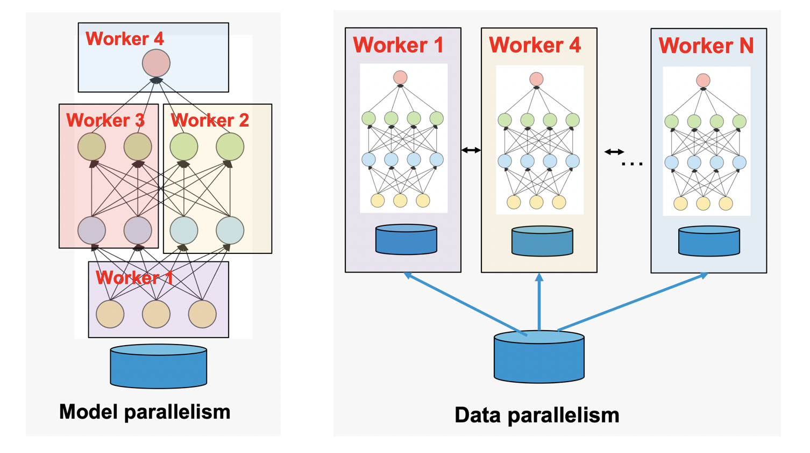
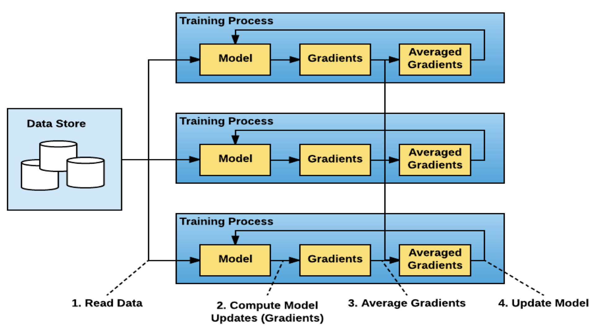

# Data Parallel Deep Learning
Led by Huihuo Zheng from ALCF (<huihuo.zheng@anl.gov>)

**Goal of this tutorial**
* Know how to run jobs on Theta / ThetaGPU
* Get familiar with the software frameworks on Theta / ThetaGPU
* Understand data parallelism (scaling efficiency, warmup, etc)
* Know how to modify your code with Horovod

**Table of contents**
* Model parallelism and Data Parallelism
* Horovod Data Parallel Framework
* How to instrument TensorFlow or PyTorch codes with Horovod
* Hands on examples

## I. Introduction to Data Parallel Deep Learning

The goal for train the model at large scale is to reduce the time-to-solution to reasonable amount. By using training the model in parallel, it reduces the total training time from weeks to minutes. 


### Model Parallelism and Data Parallelism

* **Model parallelization**: in this scheme, disjoint subsets of a neural network are assigned to different devices. All the computations associated to the subsets are performed concurrently. 
	
  Communication happens between devices whenever there is dataflow between two subsets. 
  
  Model parallelization is suitable when the model is too large to be fitted into a single device (CPU/GPU) because of the memory capacity. However, partitioning the model into different subsets is not an easy task, and there might potentially introduce load imbalance issues limiting the scaling efficiency.  

2. **Data parallelization**: in this scheme, all the workers own a replica of the model. The global batch of data is split into multiple minibatches, and processed by different workers. Each worker computes the corresponding loss and gradients with respect to the data it posseses. 

  Before the updating of the parameters at each epoch, the loss and gradients are averaged among all the workers through a collective operation. This scheme is relatively simple to implement. MPI_Allreduce is the only commu



Our recent presentation about the data parallel training can be found here: https://youtu.be/930yrXjNkgM

## II. Horovod Data Parallel Frameworks

Reference: https://horovod.readthedocs.io/en/stable/
1. Sergeev, A., Del Balso, M. (2017) Meet Horovod: Uber’s Open Source Distributed Deep Learning Framework for TensorFlow. Retrieved from https://eng.uber.com/horovod/
2. Sergeev, A. (2017) Horovod - Distributed TensorFlow Made Easy. Retrieved from https://www.slideshare.net/AlexanderSergeev4/horovod-distributed-tensorflow-made-easy

3. Sergeev, A., Del Balso, M. (2018) Horovod: fast and easy distributed deep learning in TensorFlow. Retrieved from arXiv:1802.05799

### TensorFlow with Horovod
1) **Initialize Horovod**
```python
import horovod.tensorflow as hvd 
hvd.init()
```
After this initialization, the rank ID and the number of processes can be refered as ```hvd.rank()``` and ```hvd.size()```. Besides, one can also call ```hvd.local_rank()``` to get the local rank ID within a node. This is useful when we are trying to assign GPUs to each rank. 

2) **Assign GPUs to each rank**
```python
# Get the list of GPU
gpus = tf.config.experimental.list_physical_devices('GPU')
# Ping GPU to the rank
tf.config.experimental.set_visible_devices(gpus[hvd.local_rank()], 'GPU')
```
In this case, we set one GPU per process: ID=```hvd.local_rank()```

3) **Scale the learning rate with number of workers**

Typically, since we use multiple workers, if we keep the local batch size on each rank the same, the global batch size increases by $n$ times ($n$ is the number of workers). The learning rate should increase proportionally (assuming that the learning rate initially is 0.01).
```python
opt = tf.train.AdagradOptimizer(0.01*hvd.size())
```

4) **Wrap tf.GradientTape with Horovod Distributed Gradient Tape**

```python
tape = hvd.DistributedGradientTape(tape)
```
So that this can also ```tape``` operator will average the weights and gradients among the workers in the back propagating stage. 

5) **Broadcast the model from rank 0**

This is to make sure that all the workers will have the same starting point.
```python
hvd.broadcast_variables(model.variables, root_rank=0)
hvd.broadcast_variables(opt.variables(), root_rank=0)
```

6) **Checkpointing on root rank**

It is important to let only one process to do the checkpointing I/O. 
```python
if hvd.rank() == 0: 
     checkpoint.save(checkpoint_dir)
```

7) **Loading data according to rank ID**

In data parallelism, we distributed the dataset to different workers. It is important to make sure different workers work on different part of the dataset, and they together can cover the entire dataset at each epoch. 

In general, one has two ways to deal with the data loading. 
1. Each worker randomly selects one batch of data from the dataset at each step. In such case, each worker can see the entire dataset. It is important to make sure that the different worker have different random seeds so that they will get different data at each step.
2. Each worker accesses a subset of dataset. One manually partition the entire dataset into different partions, and each rank access one of the partions. 

8) **Adjusting the number of steps per epoch**

The total number of steps per epoch is ```nsamples / hvd.size()```.


We provided some examples in: 
* [03_keras_cnn_verbose_hvd.py](03_keras_cnn_verbose_hvd.py)


### Keras with Horovod
1) **Initialize Horovod**
```python
import horovod.tensorflow.keras as hvd 
hvd.init()
```
After this initialization, the rank ID and the number of processes can be refered as ```hvd.rank()``` and ```hvd.size()```. Besides, one can also call ```hvd.local_rank()``` to get the local rank ID within a node. This is useful when we are trying to assign GPUs to each rank. 

2) **Assign GPUs to each rank**
```python
# Get the list of GPU
gpus = tf.config.experimental.list_physical_devices('GPU')
# Ping GPU to the rank
tf.config.experimental.set_visible_devices(gpus[hvd.local_rank()], 'GPU')
```
In this case, we set one GPU per process: ID=```hvd.local_rank()```

3) **Scale the learning rate with number of workers**

Typically, since we use multiple workers, if we keep the local batch size on each rank the same, the global batch size increases by $n$ times ($n$ is the number of workers). The learning rate should increase proportionally (assuming that the learning rate initially is 0.01).
```python
opt = tf.optimizers.Adam(args.lr * hvd.size())
```

4) **Wrap tf.optimizer with Horovod DistributedOptimizer**

```python
opt = hvd.DistributedOptimizer(opt)
```
So that this optimizer can average the weights and gradients among the workers in the back propagating stage. 

5) **Broadcast the model from rank 0**

This is to make sure that all the workers will have the same starting point.
```python
callbacks = [
        hvd.callbacks.BroadcastGlobalVariablesCallback(0), ...
]

```
6) **Checkpointing on root rank**

It is important to let only one process to do the checkpointing I/O. 
```python
if hvd.rank() == 0:
    callbacks.append(tf.keras.callbacks.ModelCheckpoint('./checkpoints/keras_mnist-{epoch}.h5'))
```

7) **Loading data according to rank ID**

In data parallelism, we distributed the dataset to different workers. It is important to make sure different workers work on different part of the dataset, and they together can cover the entire dataset at each epoch. 

In general, one has two ways to deal with the data loading. 
1. Each worker randomly selects one batch of data from the dataset at each step. In such case, each worker can see the entire dataset. It is important to make sure that the different worker have different random seeds so that they will get different data at each step.
2. Each worker accesses a subset of dataset. One manually partition the entire dataset into different partions, and each rank access one of the partions. 

8) **Adjusting the number of steps per epoch**

The total number of steps per epoch is ```nsamples / hvd.size()```.


We provided some examples in: We provided some examples in: 
* [03_keras_cnn_concise_hvd.py](03_keras_cnn_concise_hvd.py)

## Evaluating Performance
Request a ThetaGPU node
```bash
ssh -CY user@theta.alcf.anl.gov
ssh -CY thetagpusn1
qsub -q training -I -A ATPESC2021 -t 20 -n 1 --attrs=pubnet
```
Setup the environment
```bash
source /lus/theta-fs0/software/thetagpu/conda/2021-06-26/mconda3/setup.sh
export http_proxy=http://theta-proxy.tmi.alcf.anl.gov:3128
export https_proxy=https://theta-proxy.tmi.alcf.anl.gov:3128
```

Run the example with different number of GPUs
```bash
mpirun -np 1 python 03_keras_cnn_concise_hvd.py >& concise_1.out
mpirun -np 2 python 03_keras_cnn_concise_hvd.py >& concise_2.out
mpirun -np 4 python 03_keras_cnn_concise_hvd.py >& concise_4.out
mpirun -np 8 python 03_keras_cnn_concise_hvd.py >& concise_8.out
```

```
concise_1.out:Total time: 13.148040294647217 second
concise_2.out:Total time: 8.65635347366333 second
concise_4.out:Total time: 3.7076730728149414 second
concise_8.out:Total time: 2.2868692874908447 second
```

## MPI Communication
