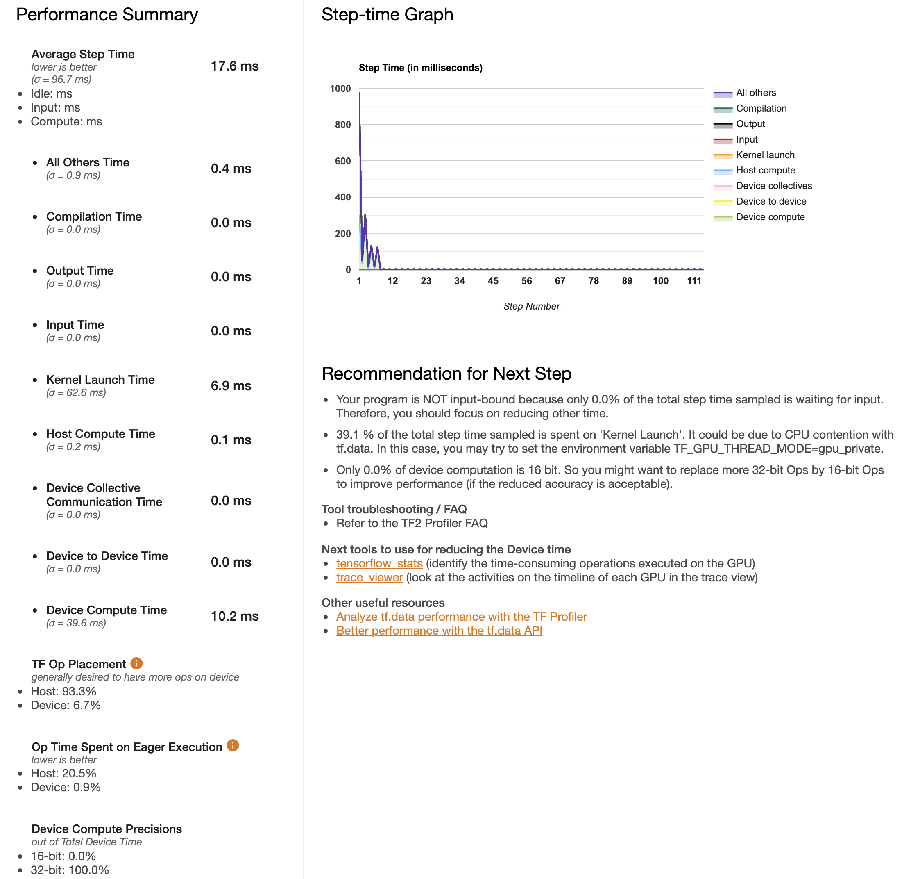
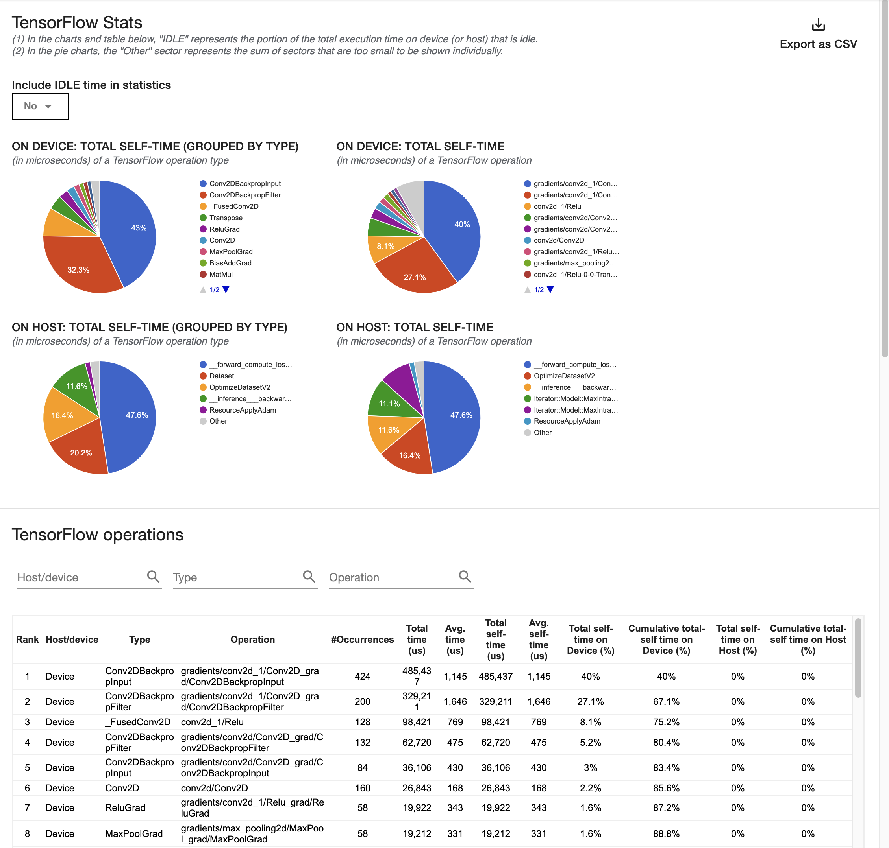
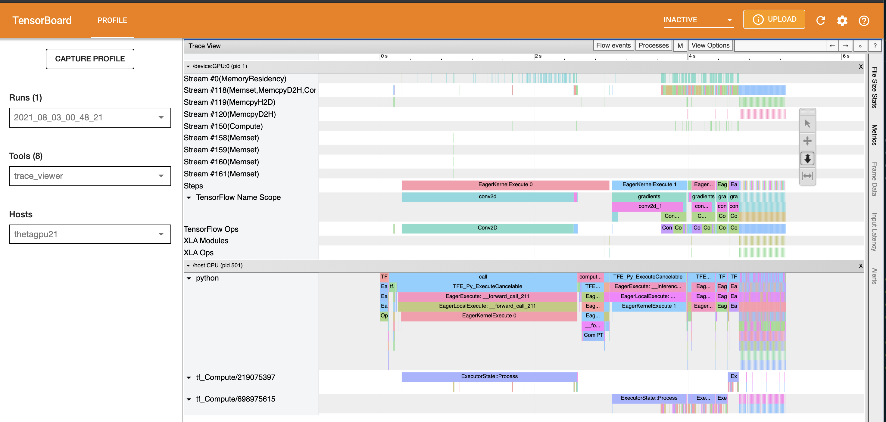

# TF Profiling Tool

Note the lines `tf.profiler.experimental.start('logdir')` and `tf.profiler.experimental.stop()` in the code.  This sets up and tears down the profiling tool built in to TensorFlow.  See the screenshots below - the main operation is conv2D backprop - a very compute heavy operation.  We may get some performance improvement further with reduced precision - see the [`reduced_precision/`](../reduced_precision) folder.

# Running the TensorFlow Profiler

When you've captured your profile data, TensorBoard will dump it into the folder `logdir` (as above) and you will have to view it.  The simplest way, for this application, is to copy it to your own laptop if you have TensorFlow installed.  If not, you can run TensorBoard on Theta and use an ssh port forward to view it on your own laptop.

Whatever you do, you can open TensorBoard like so:
`tensorboard --logdir [your/own/path/to/logdir/]`

Next, open your browser and navigate to `localhost:6006` (or, whatever port you forwarded to) and you'll see a screen like the one below:

And, if you scroll down, you'll see the list of the top 10 most time consuming operations:

This list shows us that the top operations are largely all convolution ops (particularly backprop).  The profiler at the top also points out that 0% of the graph is in reduced precision, which could give us a speedup.  We'll try that next but first let's review the other tabs:

Here is the Kernel Statistics page:

Again, this shows that the convolution operations are all the most dominant and equally distributed (roughly).

The TensorFlow statistics shows similar info:

And there is also a timeline view of all ops (trace viewer)

And zoomed:

Now, let's try running in reduced precision.
